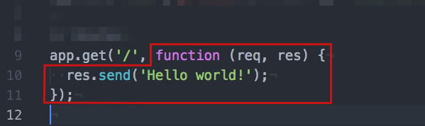

# Introduction
Let's start by setting up a small project and then explain some basic concepts.

## Setting up
Let's start creating something to work with:

```bash
$ mkdir middleware_experiments
$ cd middleware_experiments
$ npm init -y
$ npm i express -S
$ npm i nodemon -D
```

[nodemon][1] is a cool package that will watch our files and restart Express every time we save changes. Add the following line to the `scripts` section of the `package.json` file:

```
"dev": "nodemon index.js"
```

Run `npm run dev` whenever you want to start your app with nodemon watching for changes.

## About Express
[Express.js][2] is a lightweight web framework based on:

1. The [http module][3], which is part of the [Node.js][4] core modules.
2. And [connect][5], which is an extensible HTTP server framework for node using "plugins" known as middleware.

So it's the fact that Express builds upon [connect][5] what makes **middleware** an essential part of Express.

## The App
Now let's create a file named `index.js`, the entry point of our application:

1. We start requiring Express and instantiating an Express object which we'll assign to the variable `app`:

  ```js
  var express = require('express');
  var app = express(); // Instantiate an express object.
  ```

2. Next we are setting the host and the port where we are gonna be running our server:

  ```js
  app.set('port', process.env.PORT || 3000);
  app.set('host', process.env.HOST || 'localhost');
  ```

3. Now a simple **route** that will send a response with the string `Hello world!` every time the server receives a `GET` request on the **root route**:

  ```js
  app.get('/', function (req, res) {
    res.send('Hello world!');
  });
  ```

4. Finally we define the **server** itself:

  ```js
  var server = app.listen(app.get('port'), app.get('host'), function () {
    var host = server.address().address;
    var port = server.address().port;

    console.log('Server listening on http://%s:%s', host, port);
    console.log('Ctrl + C to stop it.');
  });
```

As it is, our app doesn't include any middleware at all, we're just receiving a request and sending back a response, but we're not doing anything to any of them.

## What is a route
Before start explaining what middleware is, let's make clear what a **route** is. Consider the route we have so far:

```js
app.get('/', function (req, res) {
  res.send('Hello world!');
});
```

This route has two parts:

1. An **endpoint**, which is a URI (or path) and a specific HTTP request method (GET, POST, and so on).
  

2. A **request handler** which is a function that is executed when a request is received at the endpoint.
  

Middleware is just any code that is executed right after a request hits the endpoint, but before the request handler is called. So to put it in a graphic way, a middleware function would run here:


---
[:arrow_backward:][back] ║ [:house:][home] ║ [:arrow_forward:][next]

<!-- navigation -->
[home]: ../README.md
[back]: ../README.md
[next]: middleware.md

<!-- links -->
[1]: https://www.npmjs.com/package/nodemon
[2]: http://expressjs.com/
[3]: https://nodejs.org/dist/latest-v5.x/docs/api/http.html
[4]: https://nodejs.org/dist/latest-v5.x/docs/api/
[5]: https://www.npmjs.com/package/connect
