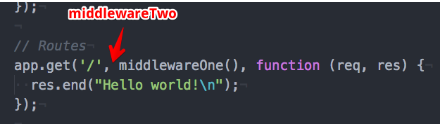

# Writing middleware
Let's write our first piece of middleware. A middleware is some code that returns a function with a particular signature. The returned function takes three arguments:

1. The request, commonly designated as `req`.
2. The response, known as `res` also by convention.
3. And `next` which is an object, and is used as a function call (`next()`) at the end.

The following function is an example of middleware:

```js
function middlewareOne(){
  function one(req, res, next) {
    res.write("#1: I'm middleware number one.\n");
    next();
  }
  return one;
}
```

So the function `middlewareOne` is a middleware that returns a function (named `one`) with the required signature. To use this middleware in our route we could insert it before the handler:

```js
app.get('/', middlewareOne(), function (req, res) {
  res.end("Hello world!\n");
});
```

> One thing I noticed is that using the [send][2] method in the handler did **not** work:

>  ```js
>  app.get('/', middlewareOne(), function (req, res) {
>    res.send("Hello world!\n");
>  });
>  ```

> Using the code above resulted in the following :x:error:x::

> ```
> $ curl http://localhost:3000/
> #1: I'm middleware number one.
> curl: (18) transfer closed with outstanding read data remaining
> ```

> The `send` method is implemented by [Express][1], and has the role of sending the HTTP response while at the same time performs other useful tasks such as defining some header fields like `Content-Length` and `Content-Type`.

Instead, I had to explicitly end the response using the [res.end][3] method, which comes from the Node.js [HTTP][3] core module. This method accepts data as an argument, flush it to the response stream before ending it, which is equivalent to:

```js
res.write("Hello world!\n");
res.end();
```

If we start the server and make a request using [curl][5], this is the result:

```
$ curl http://localhost:3000/
#1: I'm middleware number one.
Hello world!
```

We can see how `middlewareOne` wrote its piece to the request stream before passing control with `next()` to the route, which ended the response explicitly.

You can check out the project at this stage using:

```bash
$ git checkout tags/v0.2
$ npm run dev
```

## Other ways of adding middleware
Express provides a method named `use` for mounting middleware at a given path, for example:

```js
app.use(function middlewareTwo(req,res,next){
  res.write("#2: I'm middleware number two.\n");
  next();
});
```

In this case we're not specifying any **path**, so it defaults to `/`, later we'll see some examples where we pass a path as a first argument to `app.use`. Let's run curl to see what we get:

```
$ curl http://localhost:3000/
#2: I'm middleware number two.
#1: I'm middleware number one.
Hello world!
```

That means that `middlewareTwo` runs in the first place, before `middlewareOne`. Check this image:



You can check out the project at this stage using:

```bash
$ git checkout tags/v0.3
$ npm run dev
```

---
[:arrow_backward:][back] ║ [:house:][home] ║ [:arrow_forward:][next]

<!-- navigation -->
[home]: ../README.md
[back]: intro.md
[next]: #

<!-- links -->
[1]: http://expressjs.com/
[2]: http://expressjs.com/en/4x/api.html#res.send
[3]: https://nodejs.org/api/http.html#http_response_end_data_encoding_callback
[4]: https://nodejs.org/api/http.html
[5]: http://curl.haxx.se/
